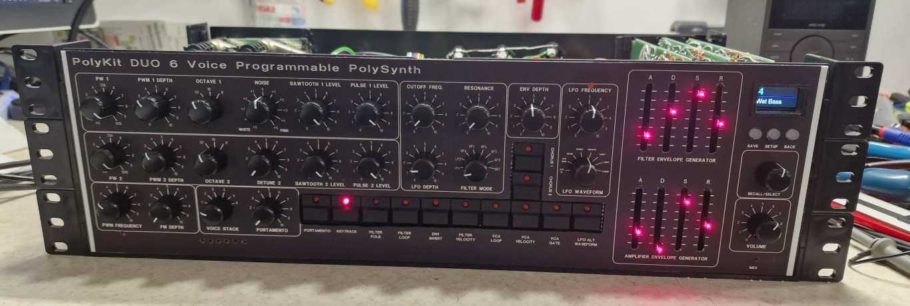

# PolyKit-DUO-polyphonic-synthesizer

Based on the PolyKit DCO and PolyKit-x-voice board projects by PolyKit (Jan Knipper). This design takes Jan's work and expands it into a fully programmable 6 voice DCO based synthesizer. 

The synth is comparable to a Juno 106 combined with a Crumar Bit 01 rack unit but with full control.

This repository contains my versions of the filter/adsr/lfo with added velocity, keytracking and additional 8 filter configurations and programmer section for the Polykit DUO, the DCO and MIDI sections are available in my other repositories listed below.

## Key features

- Digitally controlled oscillators similar in design to the Roland Juno series using dual Raspberry Pi Pico's.
- Dual DCO with Sawtooth and PWM waveforms individual mixing of each.
- Multipole filters based on the Oberheim Matrix 12. 
- Dual LFOs for PWM and main synth, main LFO 16 waveforms, PWM LFO Sinewave only.
- 6 voice polyphonic dual DCOs per voice.
- Aftertouch control over DCO LFO depth, filter LFO depth or filter cutoff.
- Log and lin envelopes.
- Looping envelopes.
- Velocity sensitivity for filters and amplifiers.
- Analogue chorus similar to Juno 60.
- 999 memory locations to store patches.
- MIDI in/out/thru - channels 1-10 only.

- How it sounds...

https://youtu.be/yFFuoJo9930

## Things to fix/improve

- MIDI channel should be set by the programmer, currently the midi router on the rear can change the midi channel.

## The source of the inspiration for these modifications and acknowledgements

Polykit, also known as Jan Knipper

https://github.com/polykit/pico-dco

This is how it sounds: [Ramp sample](https://soundcloud.com/polykit/pico-dco-ramp) [Pulse sample](https://soundcloud.com/polykit/pico-dco-pulse) [Polyphonic sample](https://soundcloud.com/polykit/pico-dco-polyphonic)

Freddie Renyard for his coding of the FM inputs and patience with me whilst I debugged the voice sync of two boards together.

https://github.com/freddie-renyard

## Component sections used to build the final synth

https://github.com/craigyjp/pico-dco

https://github.com/craigyjp/Pico-DCO-DAC

https://github.com/craigyjp/3x3-Midi-Merge-Arduino-Mega

TC Electronics June-60 Chorus
